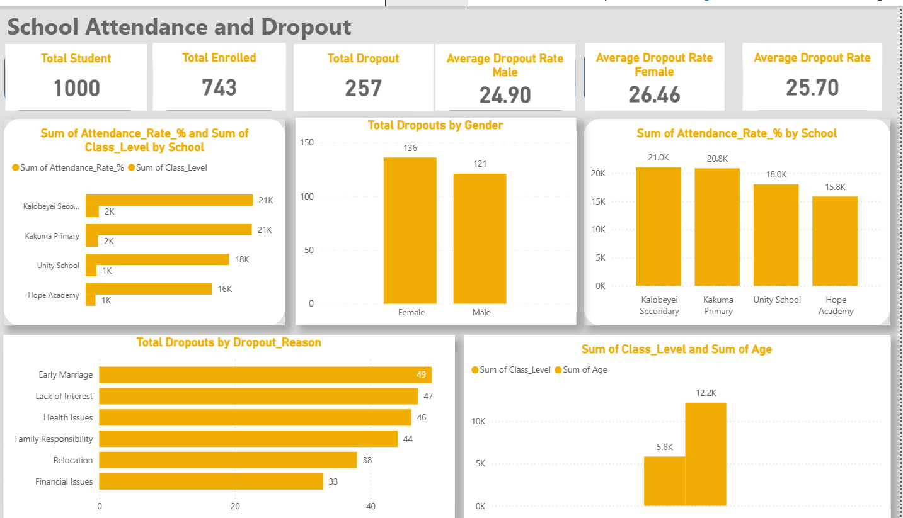
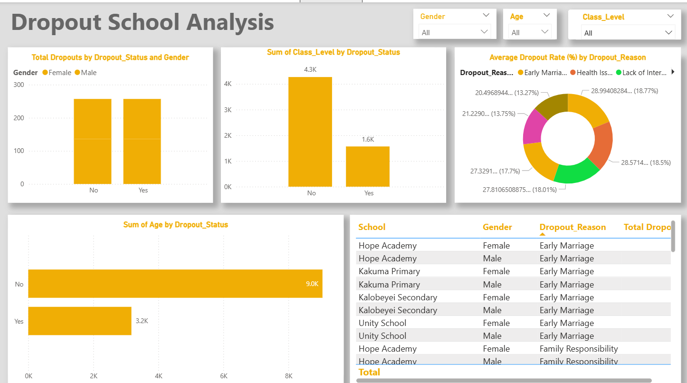

# School Attendance and Dropout Patterns in Kakuma Refugee Camp – Analysis Project
## 📊 Project Overview

This capstone project focuses on analyzing school attendance and dropout patterns within the **Kakuma Refugee Camp.** The goal is to uncover insights that can help improve educational outcomes for refugee children and youth by applying data analytics techniques to real-world datasets   

The project uses Microsoft Excel for data cleaning and transformation, and Power BI for interactive dashboards and visualizations. These tools help communicate findings clearly to both technical and non-technical audiences.

## 1. Business Topic

Analyzing educational retention and dropout patterns among students in Kakuma Refugee Camp to inform interventions that enhance attendance and reduce dropout rates.

## 2. Business Problems

High dropout rates in certain schools and demographic groups.

Gender disparities affecting attendance, including early marriage and menstrual challenges for female students.

Seasonal attendance fluctuations due to household responsibilities, such as farming or migration.

Lack of data-driven insights for NGOs and educational stakeholders to plan interventions effectively.

## 3. Business Understanding

Education in refugee settings is impacted by displacement, socio-economic constraints, and limited resources. Understanding attendance and dropout patterns is critical to improving educational retention, targeting interventions, and supporting equitable learning opportunities.

## 4. Business Objectives

Clean, organize, and standardize attendance and dropout datasets.

Identify schools, classes, or demographic groups with high dropout rates.

Analyze gender, age, and class-level differences in attendance and dropout patterns.

Visualize key insights through Power BI dashboards for clear communication.

Provide data-driven recommendations to reduce dropout rates and improve retention.

## 5. Business Criterion of Success

Successful identification of schools and demographics with high dropout rates.

Clear visualizations that communicate insights effectively to stakeholders.

Actionable recommendations based on data trends and patterns.

Creation of a fully functional dashboard and presentation showcasing findings.

Fields:
  

## 6. Business Data Understanding

**Dataset: kakuma_education_access.csv**
**Student_ID: Unique identifier for each student**
**School: School name**

**Gender: Male or Female**

**Age: Student age**

**Class_Level: Grade or class**

**Attendance_Rate: Attendance rate (%)**

**Dropout_Status: Yes/No indicating dropout**

**Reason_For_Dropout: Stated reason for leaving school**

This dataset captures attendance patterns, dropout instances, and reasons, allowing analysis across schools, genders, age groups, and time periods.

## 7. Business Requirements

**Tools & Software Needed:**

**Microsoft Excel (data cleaning, aggregation)**

**Power BI (dashboard and visualization)**

**Python (optional, for advanced analysis)**

# Dependencies:

requirements.txt can include: pandas, numpy, matplotlib, seaborn, etc.

## 8. Business EDA (Exploratory Data Analysis)

Key analyses performed:

Attendance and dropout rates per school

Gender and age-based differences in attendance and dropout

Distribution of reasons for dropout

Trends over time (seasonal/yearly patterns)

Aggregated metrics such as Dropout Rate per School and Attendance Score

## 9. Results / Conclusion

Female students are more likely to drop out due to early marriage or lack of menstrual support.

Certain schools exhibit excellent retention rates and can serve as models for best practices.

Attendance fluctuates seasonally, particularly during planting or harvesting periods.

Dropout trends vary by age, class level, and socio-economic factors, highlighting the need for targeted interventions.

## 10. Business Recommendations

Implement programs addressing female student retention, such as menstrual hygiene support and advocacy against early marriage.

Model retention strategies from schools with low dropout rates.

Schedule interventions or outreach during periods of seasonal absenteeism.

Monitor attendance trends regularly to identify high-risk groups early.

Use dashboards to communicate insights to NGOs, school administrators, and policymakers.

## 🛠 Tools Used

Microsoft Excel: Data cleaning, aggregation, and transformation

Power BI: Dashboard creation and interactive visualization

Python (optional): Advanced analytics and trend analysis

## 🧾 Deliverables

Power BI Dashboard (2+ pages):

Page 1: School Overview (dropout rate, total enrollment, filters by school/year)

Page 2: Demographics & Dropout Reasons (gender, age, trends)

PowerPoint Presentation (10–15 slides):

Introduction & Objectives

Dataset Description & Methodology

Findings with Visuals

## Recommendations

Limitations & Future Research

Conclusion

## 🙋‍♂️ Author
**Duelkuoth Joseph Gok**
**Data Analytics Capstone Project – July 2025**
**https://www.linkedin.com/in/duelkuoth-joseph/**

## ⚠️ Disclaimer

This project was developed for academic purposes using real data. It is not intended for direct policy use without further validation by relevant stakeholders.
